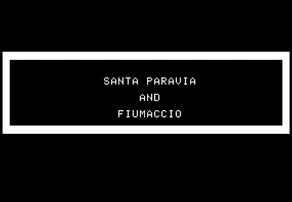

# Santa Paravia and Fiumaccio

A modern, cross-platform revival of the classic 1979 strategy game *Santa Paravia
and Fiumaccio*, in which you rule a 15th-century Italian city-state and vie to be
the first to earn the crown.

> You are the ruler of a 15th-century Italian city-state. If you rule well, you
> will receive higher titles. The first player to become a king or queen wins.
> Life expectancy then was brief, so you may not live long enough to win.

The original was written in TRS-80 BASIC by **George Blank** and published in
*SoftSide* magazine (December 1978 — the original article is included in this
repo as [`SoftSide_03_Vol_1-03_1978-12_Santa_Parvia.pdf`](SoftSide_03_Vol_1-03_1978-12_Santa_Parvia.pdf)).
It was translated to C and modernised by **Thomas Knox**.



---

## Table of Contents

- [How to Play](#how-to-play)
- [Available Versions](#available-versions)
  - [1. Terminal client (C / ncurses)](#1-terminal-client-c--ncurses)
  - [2. Network multiplayer (C client + Python server)](#2-network-multiplayer-c-client--python-server)
  - [3. Desktop GUI (Python / Dear PyGui)](#3-desktop-gui-python--dear-pygui)
  - [4. iOS & macOS app (Swift / SwiftUI)](#4-ios--macos-app-swift--swiftui)
- [Repository Layout](#repository-layout)
- [Credits](#credits)
- [License](#license)

---

## How to Play

Each turn represents one year of your reign. Your goal is to grow your city-state
and rise through the ranks of nobility — from *Sir/Lady* all the way up to
*King/Queen* — before you die of old age (or worse).

On every turn you may:

- **Buy and sell land** at fluctuating market prices.
- **Buy and sell grain** — your reserves feed your people and can be traded.
- **Distribute grain** to your serfs. Give generously and serfs migrate to your
  state and multiply; give too little and they starve, raising your death rate.
- **Set tax and customs rates.** High taxes raise money quickly but slow economic
  growth.
- **Construct buildings** — marketplaces, mills, a palace, and a cathedral — to
  boost revenue and prestige.
- **Equip soldiers** to man the walls. Your guard tower shrinks if your defenses
  weaken, inviting invasion by neighbouring states.

Rule wisely across good harvests, bad winters, invasions, and epidemics. The
first ruler to reach the rank of **King or Queen** wins the game.

**Titles, lowest to highest:** Sir/Lady → Baron/Baroness → Count/Countess →
Marquis/Marquise → Duke/Duchess → Grand Duke/Grand Duchess → Prince/Princess →
**King/Queen**.

---

## Available Versions

This repository contains four independent ways to play, all sharing the same core
game logic.

### 1. Terminal client (C / ncurses)

A single-player, full-screen text UI with a live map of your city, a stats panel,
and a scrolling event log.

**Build:**

```bash
gcc -O2 -o paravia paravia.c -lncurses
```

**Run:**

```bash
./paravia
```

Requires an 80×24 (or larger) terminal and the ncurses library.

### 2. Network multiplayer (C client + Python server)

The same terminal client can be built in network mode to play with several people
against a shared, authoritative server. All game logic (harvests, prices,
invasions, deaths, title checks) runs on the server, so clients can never disagree
on state.

**Start the server:**

```bash
pip install fastapi uvicorn
uvicorn paravia_server:app --host 0.0.0.0 --port 8765
```

**Build the network client:**

```bash
gcc -O2 -DNETWORK_MODE -o paravia paravia.c -lncurses -lcurl -lpthread
```

**Host a game (Player 0):**

```bash
./paravia --server http://yourserver:8765
```

The host is prompted for all player names, the client POSTs to `/game/new`, and it
then prints ready-to-paste join commands for everyone else, for example:

```
Player 1 (Lorenzo):
  ./paravia --server http://yourserver:8765 --join a3f2c1b0 \
            --player 1 --token 9e4f1d2a-...
```

**Other players join:**

```bash
./paravia --server http://yourserver:8765 --join a3f2c1b0 --player 1 --token 9e4f1d2a-...
```

**Client options:**

| Option | Description |
| --- | --- |
| `--server <url>` | Server base URL (default `http://localhost:8765`) |
| `--join <game_id>` | Join an existing game (non-host players) |
| `--player <N>` | Which player slot you are (0-based) |
| `--token <token>` | Your player authentication token |

**During play:** the active player sees the full interactive TUI. Watching players
see their own map/stats panel with events scrolling into the message log in real
time as the active player acts — the poll thread wakes within ~50 ms of each server
event. The turn advances automatically when the active player finishes their
purchases.

The server keeps a single game in memory (no persistence) and exposes a small HTTP
API:

| Method & path | Purpose |
| --- | --- |
| `POST /game/new` | Create a new game |
| `POST /game/{id}/ready` | Mark a player ready |
| `GET  /game/{id}/state` | Fetch the current game snapshot |
| `GET  /game/{id}/turn` | Whose turn it is |
| `GET  /game/{id}/log` | Fetch events since a cursor |
| `POST /game/{id}/action` | Perform a game action |

### 3. Desktop GUI (Python / Dear PyGui)

A graphical desktop version written in pure Python using
[Dear PyGui](https://github.com/hoffstadt/DearPyGui).

**Install and run:**

```bash
pip install dearpygui
./santa_paravia.py
```

The game logic lives in `paravia_player.py` (a `Player` class that mirrors the C
implementation) and the GUI/driver in `santa_paravia.py`.

### 4. iOS & macOS app (Swift / SwiftUI)

A native SwiftUI application that wraps the original C game engine through a
bridging header, located in the [`Santa Paravia/`](Santa%20Paravia/) directory.

Open `Santa Paravia/Santa Paravia.xcodeproj` in Xcode and build/run for your
target device or simulator.

---

## Repository Layout

| Path | Description |
| --- | --- |
| `paravia.c` | C/ncurses game — single-player and network client (built with `-DNETWORK_MODE`). |
| `paravia_server.py` | FastAPI network broker for multiplayer games. |
| `paravia_player.py` | Python port of the player/game logic (`Player` class). |
| `santa_paravia.py` | Dear PyGui desktop GUI. |
| `Santa Paravia/` | Native iOS/macOS SwiftUI app (Xcode project) wrapping the C engine. |
| `*.gif` | Sprite/art assets used by the games. |
| `Santa Paravia Theme.mp3` | Game theme music. |
| `Paravia.mov` | Gameplay recording. |
| `SoftSide_03_Vol_1-03_1978-12_Santa_Parvia.pdf` | Original 1978 *SoftSide* magazine article. |

---

## Credits

- **Original game** © 1979 by **George Blank**, published in *SoftSide* magazine.
- **C translation, curses TUI, bug fixes, and modernisation** by **Thomas Knox**
  (`<tknox@mac.com>`), 2000–2026.
- Portions © 1979 George Blank, used with permission.

---

## License

This project is released under the **GNU General Public License v2.0 (or later)**.
See the [`LICENSE`](LICENSE) file for the full text.
